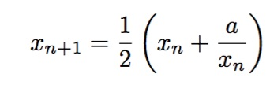

# Homework 01: some Pythonic C

---

*Due 2/5/20 by 3pm*
 
---

This is the initial repository for the first homework assignment for
the Fall 2020 offering of Reed's CSCI 221. It only contains three
files at the moment: this `README` file describing the exercises of
the assignment, along with two sample files that are each an elaborate
solution to the fourth exercise of Lab 01.

You should create a C++ source file (with suffix `.cc`) for each of
the exercises below. Follow each specification carefully, test your
code with several inputs to see whether your code works, and 
submit all the work with add/commit/push, just as you did with
Lab 01.

Please also work to mimic the coding style guidelines and formatting
that I am suggesting with my sample source file `guess6.cc`. We 
will talk more about "good coding style" as the semester progresses,
and you might even adopt your own, similar style. In addition, we'll
talk soon about strategies for debugging and testing your code. We
will suggest schemes for generating test inputs, and ways of 
scripting your tests and capturing your tests' output using Linux.

The first four exercises should only use basic integer operations and 
`std::cout` to compute and report its output. **You should not use
string operations for these.** The sixth exercise allows you to
use string operations to build and output its strings.

A final note: you should work to complete each of these exercises
so that they compile and run correctly. Should you face problems
in solving an exercise, you can still submit broken code. In your
top comment in that file **PLEASE** *let us know in what way the
code is broken* (why it doesn't compile, or what tests failed, etc.).
In some cases, we may be willing to give partial credit if you were
diligent/good about identifying the problem.

---

### Exercise 1: divisors

Write a C++ program `divisors.cc` that requests an integer value, and
then lists all the positive divisors of that integer. Your code can
assume they enter an integer that's encodeable as a C++ `int` type,
but if the integer they enter is less than 1, it should complain about
their input. Your code should exactly mimic the sample interactions I
show just below. This includes use of an 
[Oxford comma](https://en.wikipedia.org/wiki/Serial_comma)
before the mention of the last divisor.

    % ./divisors
    Enter a positive integer just below:
    35
    The divisors of 35 are 1, 5, 7, and 35.
    % ./divisors
    Enter a positive integer just below:
    1
    The divisor of 1 is 1.    
    % ./divisors
    Enter a positive integer just below:
    2
    The divisors of 2 are 1 and 2.
    % ./divisors
    Enter a positive integer just below:
    0
    The number 0 is not a positive number.

Note that the `%` line is me running the command in Linux. The next
three lines are my interaction with the C++ program.

You should only use the basic integer calculations to compute this. There
is no need to use any library functions and/or floating point.

*Hint:* recall that you can check divisibility with the *integer remainder* 
(sometimes called "mod") operator. In C++ the operator is `%`.

### Exercise 2: triangle

Write a C++ program that, when given an integer, outputs a diagram to
the terminal that looks like a triangular stack of that integer's
height, like so:

    % ./triangle 
    Enter a height: 4
       *
      * *
     * * *
    * * * *     
    % ./triangle 
    Enter a height: 1
    *    
    % ./triangle 
    Enter a height: 2
     *
    * *

It should exactly mimic the interactions just above. The bottom row of
asterisks should start at the leftmost column on the console, and
there should be a single space between each asterisk on a row.

---

### Exercise 3: digits

Write a C++ program that request an integer input from its user. *Using
only integer operations* (namely, the integer division and the integer 
remainder operations) it should compute and output the integer whose
digits are the same digits as the input integer, but in reverse.

Furthermore, if that sequence of digits forms a palindrome (if they
read the same forwards as backwards) it should report that as well.

This program won't work properly if the number is negative or is a positive
multiple of 10. If they enter a number like that, the program should 
report that fact and exit.

    % ./digits
    Enter a number and I will report its reversal number: 234
    Its reversal number is 432.
    % ./digits
    Enter a number and I will report its reversal number: 1020
    Oops! I can't handle that number. Sorry.
    % ./digits
    Enter a number and I will report its reversal number: 10201
    Its reversal number is 10201.
    That number is a decimal palindrome.
    
---
### Exercise 4: power2

Write a C++ program that, when given an integer, computes the smallest
power of two that is largest than that integer. For example,

    % power2
    Enter an integer: 28
    32
    % power2
    Enter an integer: 3
    4
    % power2
    Enter an integer: 1
    1
    % power2
    Enter an integer: 0
    1

---

### Exercise 5: square root of 2.0

There's a classic algorithm for computing the square root of a
floating point number *a*
[invented by Newton](https://en.wikipedia.org/wiki/Newton%27s_method)
that works as follows: Come up with an initial estimate *x0* for the
square root (usually half of *a*) and then refine that guess with the
formula given by

Write a C++ program that demonstrates the execution of this algorithm
on a value that's input by the user. It should use the `double`
floating point type and stop the iteration when successive estimates
differ by less than 0.000000001.  It should output the successive
estimates, too.

Note that you do not need to keep track of the whole sequence of
estimates. Just track the current and previous estimates in two
variables, while your loop is running.

---

### Exercise 6: power two sum

Consider the following expressions made up of 1s, parentheses, and `+`.

    1
    (1+1)
    ((1+1)+(1+1))
    (((1+1)+(1+1))+((1+1)+(1+1)))

Note that these sums are each a certain kind of decomposition of a
powers of 2.  The first is just `2**0`, the second sums to `2**1` or
2, the third sums to `2**2` or 4, and the fourth sums to `2**3` or
8. Note also that a sum is just the parenthesized sum of the prior
expression, repeated.

Write a program `sumOnes.cc` that, when given a positive integer *n*
it outputs the first *n* such decompositions.

For this code, you'll probably want to build a string that looks like
one of the lines above. To do this, include a line with

    #include <string>

at the top of your file and then you can declare a variable like so

    std::string sum = "1";

within your `main` function. You can then use the string concatenation
operation `+` to build larger strings. For example if `w` is the string
`"hello"`, then the statement

    v = "why" + w + " there, " + w;

would set `v` to the string "why hello there, hello".

**Bonus exercise:** 
The decompositions above only work for powers of two. You could imagine, 
instead, decompositions for numbers that are not powers two. For example,
the decompion of 6 could be something like:

	   (((1+1)+1)+((1+1)+1))

And maybe it would be

	   ((((1+1)+1)+((1+1)+1))+1)+((((1+1)+1)+((1+1)+1))+1)
    
for 14. I'll let you devise the pattern, it need not be the same as what 
I have above for 6 and 14, but it *should* be some reasonable generalization
of the strings described above for powers of two.

Write a program that instead enumerates all the decompositions
from 1 up to *n*.

